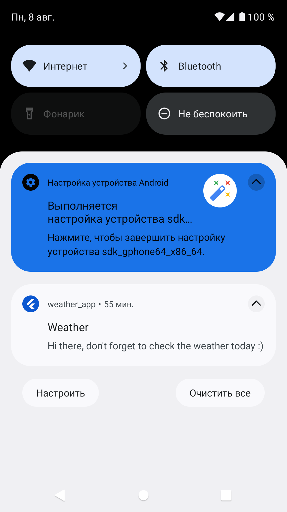
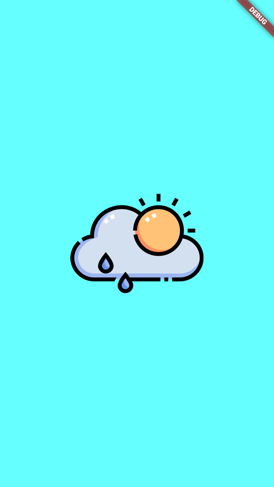
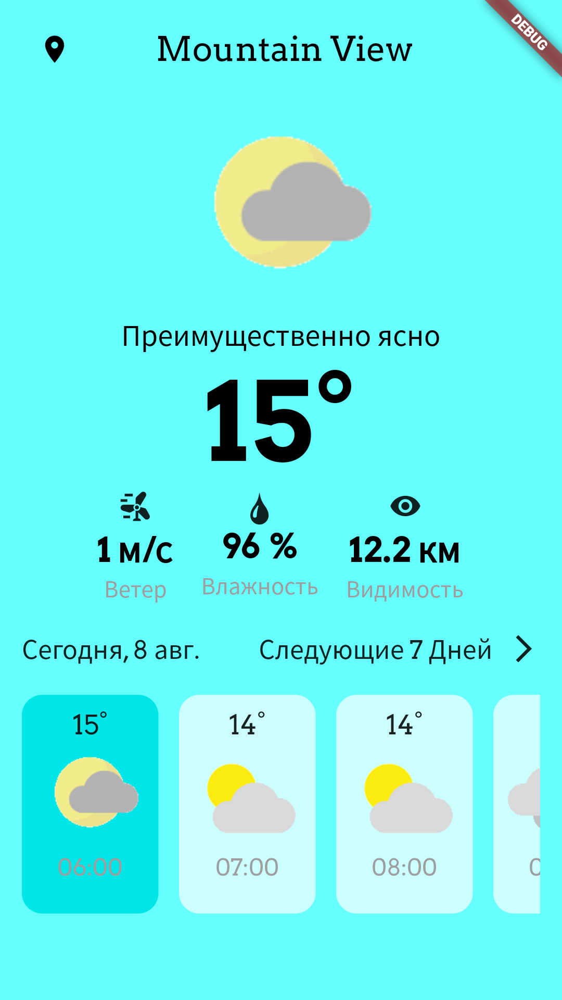
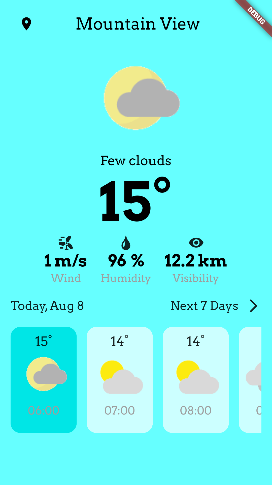
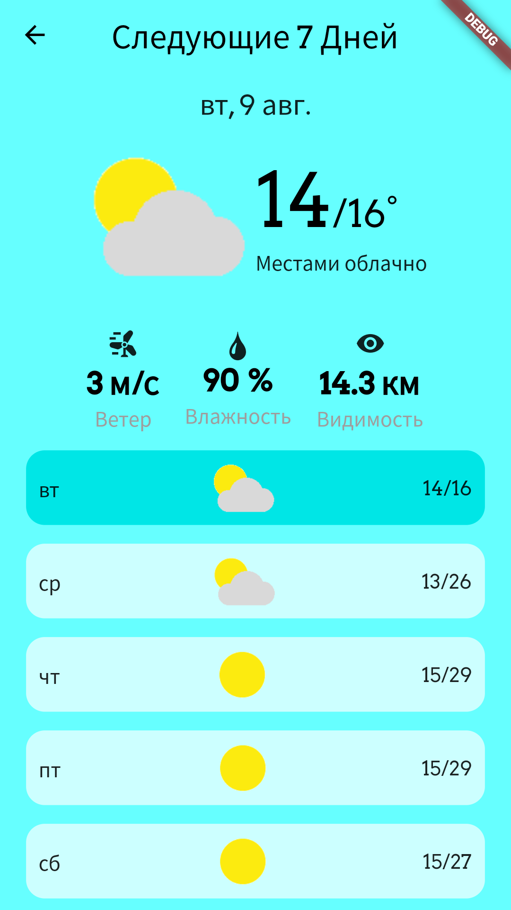
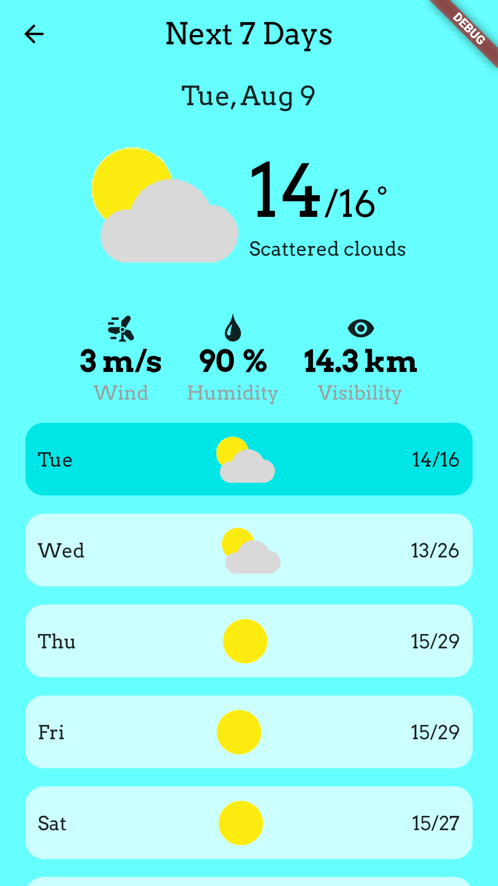

# Weather Forecast
App was written with using of Clean Architecture and Bloc as state manager.

# Functionality
This app can show you weather forecast by hours/days on your current geolocation parameters (Kiev by default if there are none). App caches last forecast data and if you don't have internet connection it will show you this data. Also application supports localization in two languages (english and russian) and everyday reminds you to check weather forecast.

## Screenshots from the program

Push notification

Splash screen

Hourly weather forecast screen with different localizations

  
  

Daily weather forecast screen with different localizations

  
  

